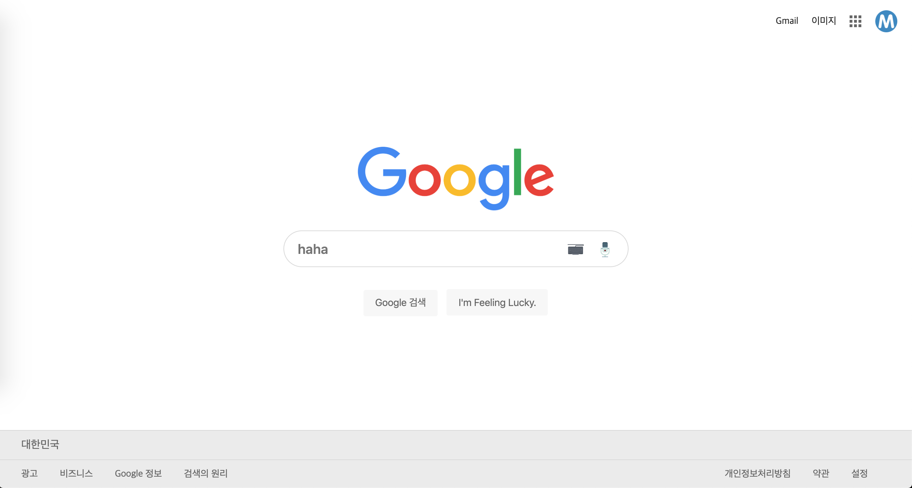
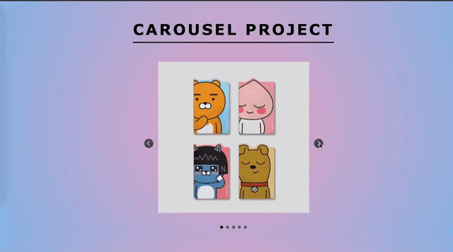
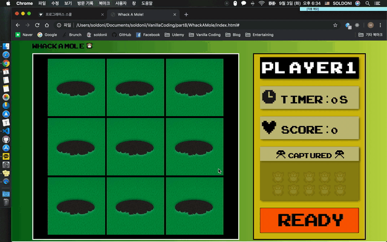
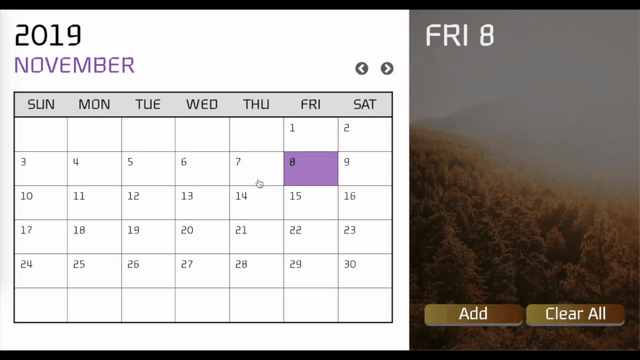
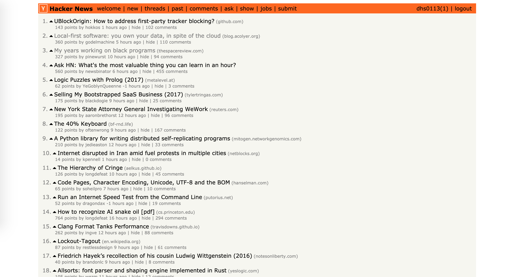

# Vanilla01_Copy of Google
[바닐라코딩 prep코스] Google.com을 그대로 copy하는 실습 과제입니다.

바닐라코딩 과제 보안을 위해 html 및 css 파일은 업로드하지 않습니다. 양해 부탁드립니다.

# Vanilla 02_Carousel

[바닐라코딩 prep코스] Carousel을 만들어보는 실습 과제입니다.

바닐라코딩 과제 보안을 위해 js 파일은 업로드하지 않습니다. 양해 부탁드립니다.

# Vanilla 03_Whack A Mole!

[바닐라코딩 prep코스] 두더지잡기 게임(Whack A Mole)을 만들어보는 실습 과제입니다.

바닐라코딩 과제 보안을 위해 js 파일은 업로드하지 않습니다. 양해 부탁드립니다.

# Vanilla 04_Calendar + Todolist

[바닐라코딩 prep코스] 달력+Todolist를 만들어보는 실습 과제입니다.

바닐라코딩 과제 보안을 위해 js 파일은 업로드 않습니다. 양해 부탁드립니다.

# Vanilla 05_Copy of Hacker News

[바닐라코딩 추가 과제] Admission Test 통과 이후 주어진 추가 과제입니다. Hacker News API를 이용하여 Hacker News website를 copy하는 과제입니다.

1) 메인 페이지의 html, css와 javascript만 작업했습니다. 나머지 부분들은 단순히 hacker news 사이트의 링크로 연결됩니다.

2) Hacker News API로 서버에 자료를 비동기로 요청한 후, 수신받은 데이터 순서와 동일하게 DOM에 표현하는 것이 메인입니다.

